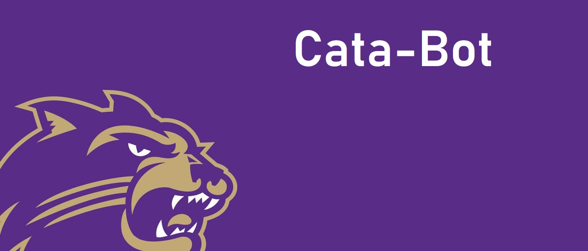

<!-- PROJECT LOGO -->
<br />
<p align="center">
    <!-- <a href="https://github.com/aidankirk617/CataBot"> -->
    
  </a>

  <h3 align="center">CataBot</h3>

  <p align="center">
    A modular Discord bot for WCU students
    <br />
    <a href="https://github.com/aidankirk617/CataBot"><strong>Explore the docs »</strong></a>
    <br />
    <br />
    <!-- Commented out until we have a live demo -->
    <!--<a href="https://github.com/github_username/repo">View Demo</a> -->
    ·
    <a href="https://github.com/aidankirk617/CataBot/issues">Report Bug</a>
    ·
    <a href="https://github.com/aidankirk617/CataBot/issues">Request Feature</a>
  </p>
</p>

<!-- PROJECT SHIELDS -->
<!--
*** I'm using markdown "reference style" links for readability.
*** Reference links are enclosed in brackets [ ] instead of parentheses ( ).
*** See the bottom of this document for the declaration of the reference variables
*** for contributors-url, forks-url, etc. This is an optional, concise syntax you may use.
*** https://www.markdownguide.org/basic-syntax/#reference-style-links
-->
    


<!-- TABLE OF CONTENTS -->
## Table of Contents

* [About the Project](#about-the-project)
  * [Built With](#built-with)
* [Getting Started](#getting-started)
  * [Prerequisites](#prerequisites)
  * [Installation](#installation)
* [Usage](#usage)
* [Roadmap](#roadmap)
* [Contributing](#contributing)
* [License](#license)
* [Contact](#contact)
* [Acknowledgements](#acknowledgements)


<!-- ABOUT THE PROJECT -->
## About The Project

<!--[![Produc Name Screen Shot][product-screenshot]](https://example.com) -->

Catabot is a modular discord bot created to help WCU students navigate their day to day school life with ease.

New student or old student, it gets very hectic trying to keep up with campus events,
hours of operation, or even what’s for dinner tonight in the cafeteria. Through a
simple question command, members of the WCU Computer Science discord can ask Catabot
any of these questions and get an immediate response. No more internet searches, no
more looking through the notes section of your phone, and thankfully no more asking 
strangers on the street for help. That’s called social interaction, and as Computer Science majors,
we don’t support it.

Catabot also serves as an open source group project between Computer Science 
students, utilizing the agile development lifecycle, as well as SCRUM. This
creates not only an efficient and objective oriented work environment, but
provides students of WCU the experience of working on a development team before
graduation, or even engaging in possible internships. This not only strengthens
our Computer Science education, but also makes way to ease WCU students into the workforce.

### Built With

* []()
* []()
* []()


<!-- GETTING STARTED -->
## Getting Started

To get a local copy up and running follow these simple steps.

### Prerequisites

This is an example of how to list things you need to use the software and how to install them.
* npm
```sh
npm install npm@latest -g
```

### Installation

1. Clone the repo
```sh
git clone https://github.com/aidankirk617/CataBot.git
```
2. Install NPM packages
```sh
npm install
```

<!-- USAGE EXAMPLES -->
## Usage

Use this space to show useful examples of how a project can be used. Additional screenshots, code examples and demos work well in this space. You may also link to more resources.

_For more examples, please refer to the [Documentation](https://example.com)_


<!-- ROADMAP -->
## Roadmap

See the [open issues](https://github.com/aidankirk617/CataBot/issues) for a 
list of proposed features (and known issues).


<!-- CONTRIBUTING -->
## Contributing

Contributions are what make the open source community such an amazing place to be learn, inspire, and create. Any contributions you make are **greatly appreciated**.

1. Fork the Project
2. Create your Feature Branch (`git checkout -b feature/<Issue or feature name`)
3. Commit your Changes (`git commit -m 'Add some <Issue or feature name>'`)
4. Push to the Branch (`git push origin feature/<Issue or feature name>`)
5. Open a Pull Request


<!-- LICENSE -->
## License

Distributed under the ____ License. See `LICENSE` for more information.


<!-- CONTACT -->
## Contact

Your Name - [@twitter_handle](https://twitter.com/twitter_handle) - email

Project Link: [https://github.com/aidankirk617/CataBot#built-with](https://github.com/aidankirk617/CataBot#built-with)


<!-- ACKNOWLEDGEMENTS -->
## Future Implementations

* [Weekly menu items for cafeteria](https://www.youtube.com/watch?v=C1AauAyQ_wg)
* [Hours of operation](https://www.youtube.com/watch?v=C1AauAyQ_wg)
* [Events on campus](https://www.youtube.com/watch?v=C1AauAyQ_wg)


<!-- MARKDOWN LINKS & IMAGES -->
<!-- https://www.markdownguide.org/basic-syntax/#reference-style-links -->
[contributors-shield]: https://img.shields.io/github/contributors/othneildrew/Best-README-Template.svg?style=flat-square
[product-screenshot]: images/logo2.jpg
